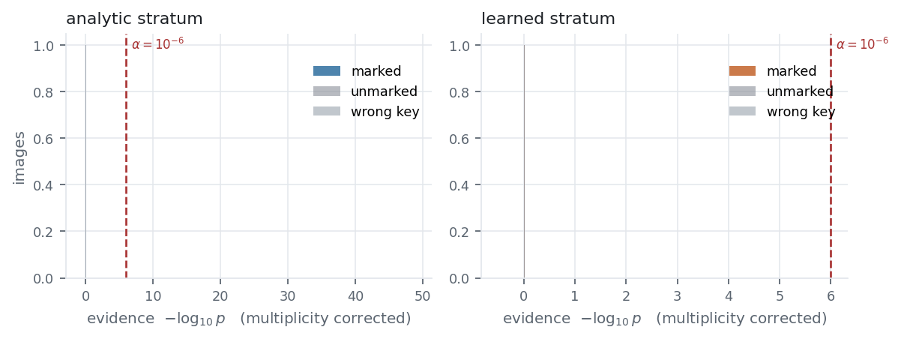
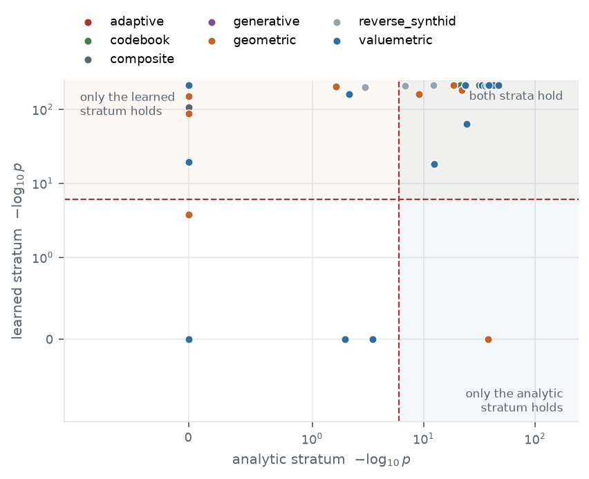
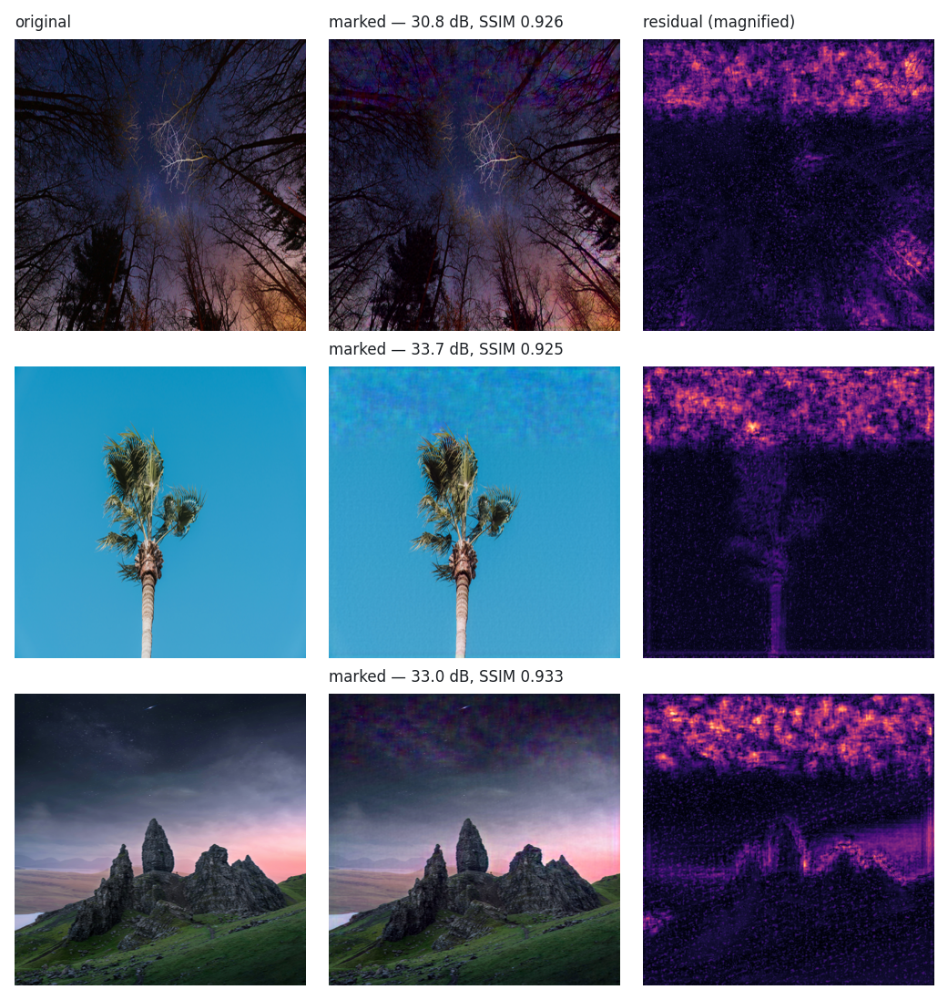

# SIGIL

Research implementation of a stratified watermark for generated images.

SIGIL combines two complementary marks:

- **SIGIL-A**, an analytic spectral mark with a keyed, distribution-free null
  and exact invariance to translation, radial filtering, and global gain;
- **SIGIL-L**, a learned spatial mark trained against image transformations,
  latent regeneration, and adaptive removal attempts.

The detector treats the false-positive rate as part of the design. Each search
is charged with Bonferroni correction, and the active strata are combined with
a weighted Bonferroni rule. The repository also includes a Lean 4
formalization of the statistical and invariance arguments, the attack suite,
and the scripts used to generate the paper's tables and figures.

> **Status:** research prototype. The analytic stratum runs without a learned
> checkpoint. The learned stratum requires trained weights, and the complete
> evaluation requires local image data, model downloads, and a Google Cloud TPU v4
> environment. The reported measurements are not a production guarantee.

## Results at a glance

The checked-in report summarizes one 80-image arena at operating point
`alpha = 1e-6`. An attack is *admissible* when it preserves PSNR >= 24 dB and
SSIM >= 0.70; geometric and global photometric edits are included by
construction because pixel metrics do not describe their visual cost.

| System | Embedding PSNR | Embedding SSIM | Clean TPR | Unmarked FPR | Mean TPR on admissible attacks | Worst admissible TPR |
| --- | ---: | ---: | ---: | ---: | ---: | ---: |
| SIGIL | 31.6 dB | 0.807 | 100% | 0.0% | 96.5% | 2% |
| SynthID-style | 31.3 dB | 0.812 | 100% | 0.0% | 66.3% | 0% |
| StableSig-style | 32.0 dB | 0.785 | 100% | 0.0% | 95.1% | 2% |

These values are a single reported run, not a claim of universal performance.
See the full [attack-survival report](results/SURVIVAL.md), the
[two-stratum ablation](results/ABLATION.md), and the machine-readable files in
`results/` for the evaluation scope and per-attack rates.

## A quick look

The figures below are generated from the checked-in outputs in
`results/figures/`.

`fig01_separation.png` compares marked, unmarked, and wrong-key images. The
wrong-key control checks that the detector responds to the secret key rather
than merely detecting that an image has been modified.



`fig07_complementarity.png` shows why the two strata are combined: some attacks
leave the analytic spectrum readable while damaging the learned mark, while
others do the reverse.



`fig10_visual.png` shows the image-level embedding cost and a magnified view of
the residual.



## Repository layout

```text
sigil/       Core image, analytic, learned, attack, and fusion modules
scripts/     Corpus, training, benchmark, figure, and report entry points
results/     Checked-in measurements, summaries, and figures from one run
checkpoints/ Small run metadata; trained weights are ignored by Git
lean/        Lean 4 statements and proofs for the statistical core
paper/       LaTeX manuscript and generated tables
images/      Dataset documentation and metadata; review its terms before use
run_all.sh   End-to-end reproduction script
```

## Installation

Python 3.11 is the tested baseline. From the repository root, create an
environment and install the dependencies for the core modules:

```bash
python -m venv .venv
source .venv/bin/activate
python -m pip install --upgrade pip
python -m pip install numpy pillow opencv-python scikit-image ruff
```

The learned model, TPU acceleration, and full benchmark use JAX with libtpu,
PyTorch, and experiment tools:

```bash
python -m pip install "jax[tpu]" -f https://storage.googleapis.com/jax-releases/libtpu_releases.html
python -m pip install torch torchvision pandas matplotlib
python -m pip install diffusers transformers accelerate
```

`sigil.kernels` executes high-throughput fused resynchronisation scan kernels
compiled natively for Google Cloud TPU v4 (including v4-32 pod slices) via JAX and XLA.

The repository does not currently define a packaged `pip install -e .` entry
point. Run the examples and scripts from the repository root so Python can
resolve the `sigil` package.

## Minimal analytic example

The analytic stratum can be used on CPU without a learned checkpoint:

```python
from sigil.common import load_image
from sigil.system import Sigil, SigilConfig

image = load_image("path/to/image.png")
watermarker = Sigil(
    SigilConfig(latent_checkpoint=None, device="cpu", alpha=1e-6)
)

marked = watermarker.embed(image, nonce=12345)
detection = watermarker.detect(marked.image, expected_nonce=marked.nonce)

print(f"embedding PSNR: {marked.psnr:.2f} dB")
print(f"detected: {detection.detected}, p-value: {detection.pvalue:.3e}")
```

To use the learned stratum, pass a checkpoint path through
`SigilConfig(latent_checkpoint="checkpoints/latent.pt")`. A two-grid run can
also provide `latent_coarse_checkpoint` and matching budget weights.

## Reproducing the paper

The full pipeline expects these inputs outside the source tree:

- DIV2K images under `data/div2k/`;
- the photographic evaluation images, supplied through the `PHOTO_SOURCE`
  environment variable or placed under `data/corpus/photo/`;
- optional synthetic images under `data/corpus/synthetic/`;
- a Google Cloud TPU v4 accelerator for learned training and detection.

The `images/` directory contains dataset documentation and metadata, not a
license grant for redistributing image files. Read
[`images/lite/TERMS.md`](images/lite/TERMS.md) before downloading or sharing
the associated data.

Run the complete pipeline from the repository root in a Bash-compatible shell:

```bash
export PHOTO_SOURCE=/path/to/photographs
LIMIT=20 STEPS=12000 bash run_all.sh
```

`run_all.sh` builds the corpus, calibrates content anchors, trains the learned
stratum, runs the theory checks and attack benchmarks, writes figures and
tables, builds the Lean project, and compiles the paper. Long-running stages
write to `results/` as they run, so individual scripts can be rerun directly.

Useful checks and smaller pipeline stages are:

```bash
python -m ruff check sigil scripts
python -m ruff format --check sigil scripts
python -m compileall -q sigil scripts
python scripts/theory_checks.py --limit 40
python scripts/benchmark.py --limit 20
python scripts/figures.py
python scripts/make_tables.py
```

The benchmark, figures, and table commands require the corresponding corpus
and checkpoint files. To regenerate the Markdown result summaries from arena
outputs:

```bash
python scripts/survival_report.py --summary results/arena_summary.json
python scripts/ablation_report.py
```

Build the formal proofs and manuscript separately with:

```bash
(cd lean && lake build Sigil)
(cd paper && latexmk -pdf -interaction=nonstopmode sigil.tex)
```

The reverse-SynthID adapter is optional. If the external project is available,
place it beside this repository at `../reverse-SynthID/`; otherwise the arena
skips those reference attacks.

## Interpreting the results

Files under `results/` are generated artifacts from one completed run. They are
useful for inspecting the paper without retraining, but they are not a
universal benchmark: image sources, checkpoint selection, device precision,
random seeds, and optional generative models can change runtime and measured
rates.

The comparison uses one operating point and one explicit quality budget. It
does not establish performance against every watermark, image generator, or
removal strategy. In particular, generative attacks that fall outside the
quality budget remain useful stress tests, but they should not be mixed into the
admissible-attack average.

## Contributing

See [CONTRIBUTING.md](CONTRIBUTING.md) for the project’s expectations around
reproducibility, data, checkpoints, and code checks.

## License

Released under the [Apache License 2.0](LICENSE).
