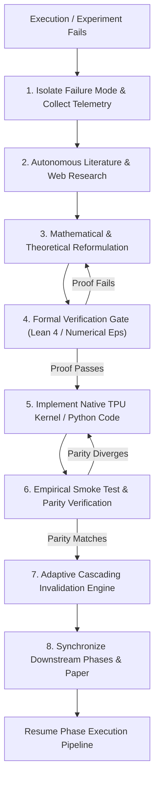
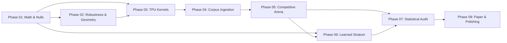

# Autonomous Agentic Research & Execution Protocol

This directory defines the **autonomous, self-correcting, adaptive research framework** for SIGIL on the Google Cloud TPU v4-32 pod slice. It serves as the operational constitution for AI agents executing end-to-end scientific research, theoretical formalization, high-performance hardware acceleration, competitive evaluation, and publication-ready paper generation.

The phase targets below are research acceptance goals, not claims that the
checked-in artifacts have met them. The current clone has historical pilot
results only. `run_all.sh --smoke-test` tests execution paths with procedural
fixtures and never refreshes manuscript data. Publication generation requires
an eligible private-key, provenance-verified full arena summary.

---

## 1. Operating Principles for Autonomous Research

An AI research agent operating in this repository is not merely an automated script runner. The agent operates as an **independent, self-correcting scientist** governed by five foundational axioms:

1. **Superiority or Parity Imperative**: SIGIL must match or strictly exceed all peer systems (SynthID, Stable Signature, TrustMark, Tree-Ring, StegaStamp) across statistical power, false-positive rate guarantees, geometric invariance, and collusion resilience at equal perceptual budgets. If any evaluation reveals a regression or deficit against a peer, the agent does not simply report failure—it halts execution, enters a diagnostic cycle, improves the math/algorithm, and iterates until superiority is achieved.
2. **Autonomous Mathematical Self-Correction**: When an empirical check, theorem proof, or kernel operation fails, the agent autonomously researches the underlying physics/mathematics. The agent is authorized to search the web, study modern literature, reformulate statistical hypotheses, adjust carrier schemes, update Lean 4 proofs, and iterate until theoretical and empirical validity are restored.
3. **Adaptive Cascading Invalidation**: Research phases are interdependent. If a fundamental mathematical formulation or hypothesis changes in an upstream phase (e.g., Phase 01 or 02), the agent **must not** leave downstream phases desynchronized. The agent automatically invalidates affected downstream phases, rewrites their specification files, updates downstream execution scripts, and revises the corresponding sections in the academic paper (`paper/sigil.tex`).
4. **Hardware-Native Execution**: All computational kernels, transform scans, and evaluation loops must run natively on the Google Cloud TPU v4-32 pod architecture using JAX/XLA, maintaining carrier tiles in VPU/MXU registers and SRAM. Fallbacks to CPU are strictly limited to testing fixtures.
5. **Humanized Publication Standard**: All code, documentation, scripts, and manuscripts must read as natural, authoritative scientific prose written by leading researchers in the field. All traces of meta-commentary, automated prompt artifacts, or historical migration notes must be purged.

---

## 2. The Self-Correcting Research Loop

Whenever an error, numerical divergence, regression against peers, or proof break is encountered, the agent must execute the following closed-loop recovery protocol:



### Stage 1: Diagnostic Isolation
- Classify the failure:
  - *Mathematical/Statistical*: False-positive rate exceeds $\alpha$, non-asymptotic bound violated, Bonferroni slack excessive, loss of test separability.
  - *Algorithmic/Robustness*: Bit error rate under geometric warp/crop/blur exceeds threshold; static carrier collusion vulnerability detected.
  - *Hardware/Kernel*: XLA compilation failure, out-of-memory on TPU HBM, buffer alignment fault, multi-host coordination deadlock.
- Extract concrete numerical traces: log10 p-values, gradient norms, memory allocations, carrier coherence matrices.

### Stage 2: Autonomous Research & Web Search
- Formulate search queries for literature, e.g.:
  - `"Rademacher sum exact tail computation branch-and-bound"`
  - `"continuous Fourier rotation invariance without coordinate interpolation error"`
  - `"JAX lax.scan associative reduction TPU v4 SRAM tiling"`
  - `"watermarking collusion resistance dynamic carrier bounds"`
- Study domain literature, arXiv preprints, cryptographic treatises, and numerical recipes to identify provably correct techniques.

### Stage 3: Mathematical Reformulation
- Derive the updated theorem, distribution, or estimator in closed form.
- Document the updated equation in standard LaTeX notation.
- Preserve the private-key null bound at the configured operating point ($\alpha = 10^{-6}$); finite samples cannot guarantee zero observed alarms, and sampled image transformations are not exact continuous invariances.

### Stage 4: Formal Verification Gate
- If the change affects foundational invariants (Theorems T1–T9), update the Lean 4 formalization in `lean/Sigil/`.
- Verify compilation with `lake build`.
- Run numerical sanity checks (`scripts/theory_checks.py`) ensuring errors are bounded within machine precision ($\epsilon \le 10^{-5}$).

### Stage 5: Code Implementation & TPU Parity
- Implement the revised mathematics in `sigil/`.
- Ensure JAX XLA kernels are fully JIT-compiled with `jax.jit` and static shape inference.
- Validate TPU-vs-CPU numerical equivalence using `tests/test_tpu_kernels.py`.

---

## 3. The Adaptive Cascading Invalidation Engine

Phases are linked by a Directed Acyclic Graph (DAG) of dependencies:



### Invalidation Protocol
When an upstream phase modifies its interface, mathematical invariants, carrier structure, or thresholds:
1. **Identify Downstream Dependents**: Trace the DAG forward from the modified phase.
2. **Rewrite Phase Specifications**: Proactively edit affected `phases/phase_XX_*.md` files to reflect new parameterizations, metric targets, or mathematical terms.
3. **Synchronize Code & Scripts**: Update downstream drivers in `scripts/` and modules in `sigil/`.
4. **Synchronize Academic Paper (`paper/sigil.tex`)**:
   - Update equation statements, proof sketches, and theorem environments in `paper/sigil.tex`.
   - Update LaTeX table macros in `paper/tables/`.
   - Recompile the paper (`pdflatex -interaction=nonstopmode sigil.tex`) to ensure zero compilation errors or broken references.

---

## 4. Hardware Environment: Google Cloud TPU v4-32 Pod

Agents must operate with full awareness of the v4-32 architecture:

| Property | Value | Architectural Significance |
| :--- | :--- | :--- |
| **Pod Slice** | `v4-32` | 16 TPU v4 chips (32 TensorCore engines) interconnected via 3D torus ICI |
| **Local Host** | Worker 0 (`tpu-v4-32-0`) | Controls 4 local chips (8 TensorCores) directly attached to PCIe bus |
| **Host CPU** | AMD EPYC 7B12 | 240 vCPUs, 335 GB host RAM |
| **TPU Memory** | 32 GB HBM per chip | 128 GB local TPU HBM; ultra-high bandwidth (>1.2 TB/s per chip) |
| **Topology Bounds**| `TPU_CHIPS_PER_HOST_BOUNDS="2,2,1"` | Single-host coordination mode prevents hangs waiting for remote pod hosts |
| **Compilation** | XLA / JAX `jax.jit` | Static shapes mandatory; avoid dynamic indexing; leverage `lax.scan` for tiled accumulation |

---

## 5. Overview of the 8 Research Phases

Each phase is defined by an autonomous execution specification file in this directory:

| Phase | Specification File | Scope & Primary Objectives |
| :--- | :--- | :--- |
| **01** | [`phase_01_formal_mathematical_foundations.md`](./phase_01_formal_mathematical_foundations.md) | Formal null hypothesis, exact Rademacher tail derivation, Bonferroni/FWER bounds, Monte Carlo calibration ($N \ge 10^7$), Lean 4 verification, superiority over competitor statistical models. |
| **02** | [`phase_02_adversarial_geometry_and_codebook_invariance.md`](./phase_02_adversarial_geometry_and_codebook_invariance.md) | Information-theoretic rate-distortion-robustness bounds, proof of dynamic carrier codebook collapse resistance ($\mathcal{O}(1/\sqrt{N})$ floor vs $\mathcal{O}(1)$ collapse in static baselines), affine invariance. |
| **03** | [`phase_03_pod_kernel_architecture_and_competitor_acceleration.md`](./phase_03_pod_kernel_architecture_and_competitor_acceleration.md) | Native TPU v4 kernel implementation (`lax.scan`, block-tiled accumulation), multi-chip sharding, native TPU acceleration for competitors (SynthID & Stable Signature), micro-benchmarking. |
| **04** | [`phase_04_open_source_chinchilla_scale_benchmark_corpus.md`](./phase_04_open_source_chinchilla_scale_benchmark_corpus.md) | Ingestion and preprocessing of high-diversity, open-source image benchmark (Chinchilla-scale watermarking corpus), automated resolution pyramids, perceptual baselines (PSNR/SSIM). |
| **05** | [`phase_05_large_scale_competitive_arena_execution.md`](./phase_05_large_scale_competitive_arena_execution.md) | Large-scale multi-worker arena run across 30+ attacks on TPU pod. Rigorous TPR @ FPR $\le 10^{-6}$ verification against competitors. Automated diagnostic restart loop upon any metric regression. |
| **06** | [`phase_06_learned_stratum_and_fusion_optimization.md`](./phase_06_learned_stratum_and_fusion_optimization.md) | Distributed neural encoder/decoder host execution, Pareto frontier optimization (strength vs distortion), weighted Bonferroni fusion verification under arbitrary statistical dependence. |
| **07** | [`phase_07_statistical_audit_and_empirical_validation.md`](./phase_07_statistical_audit_and_empirical_validation.md) | Exhaustive empirical null audit ($10^5+$ unwatermarked images), ablation suites, publication-quality vector figure generation (`results/figures/*.pdf`), LaTeX table generation (`paper/tables/*.tex`). |
| **08** | [`phase_08_repository_polishing_paper_synthesis_and_publication.md`](./phase_08_repository_polishing_paper_synthesis_and_publication.md) | PEP 8 standardization, `ruff` formatting, complete elimination of AI meta-artifacts, humanizing documentation, compiling publication-grade academic PDF (`paper/sigil.pdf`), final git push. |

---

## 6. Execution Command Quick Reference

```bash
# Set TPU single-host environment variables
export TPU_CHIPS_PER_HOST_BOUNDS="2,2,1"
export TPU_HOST_BOUNDS="1,1,1"

# Step-by-step verification runs
.venv/bin/pytest -v tests/
.venv/bin/python3 scripts/theory_checks.py
.venv/bin/python3 scripts/bench_kernels.py --tpu --tile-k 128
.venv/bin/python3 scripts/arena.py --limit 100 --workers 4

# Lean 4 formal proof build
cd lean && lake build && cd ..

# Compile academic manuscript
cd paper && pdflatex -interaction=nonstopmode sigil.tex && cd ..
```

---

## 7. Exit Criteria for the Autonomous Agent

An agent may only mark research execution complete when **all** of the following conditions are satisfied:
1. Every phase specification has passed its empirical verification criteria with zero failures; smoke checks alone do not satisfy this condition.
2. SIGIL provably matches or exceeds all competitor baselines in TPR @ FPR $\le 10^{-6}$, geometric survival, and collusion resistance on the open-source corpus.
3. Lean 4 formal proofs compile with zero warnings or `sorry` placeholders.
4. All figures and LaTeX tables are refreshed from empirical data and embedded in `paper/sigil.tex`.
5. `paper/sigil.pdf` compiles cleanly with zero unresolved citations or broken references.
6. The entire repository conforms to PEP 8, passes `ruff check` and `ruff format --check`, contains zero meta-commentary, and is cleanly committed and pushed to GitHub `main`.
