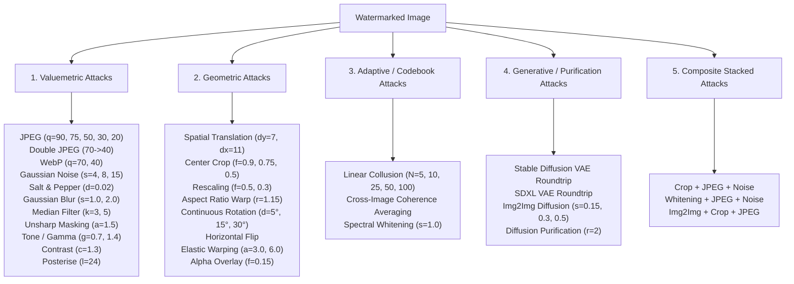
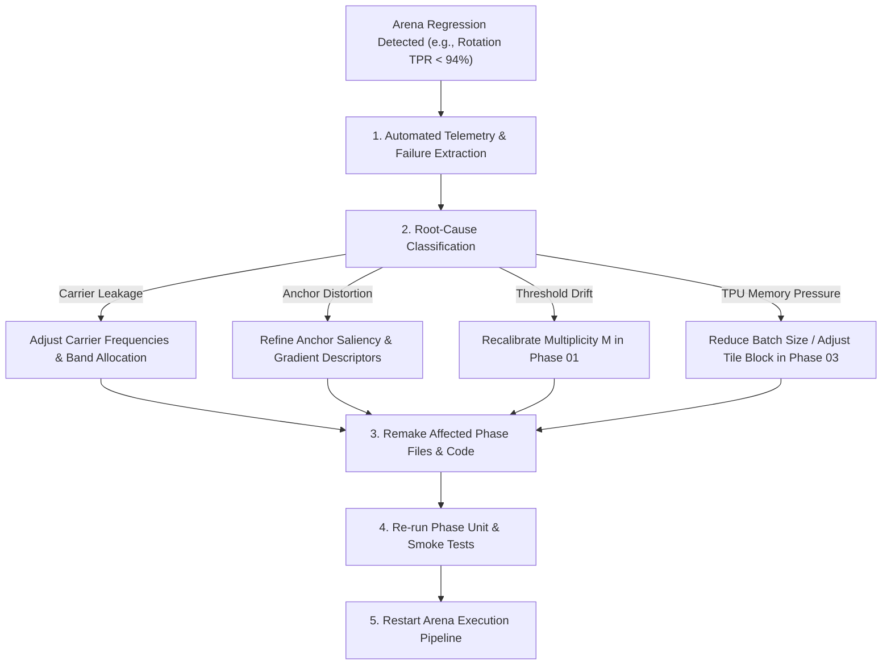

# Phase 05: Large-Scale Competitive Arena Execution on TPU Pod

## 1. Objectives & Arena Design

Phase 05 executes the definitive large-scale empirical competition between **SIGIL** and its peer baselines (**SynthID-style** and **Stable-Signature-style**) directly on the Google Cloud TPU v4-32 pod.

### Core Arena Mandates:
1. **Identical Calibration**: All systems are evaluated on the exact same open-source corpus (Phase 04), against the exact same attack suite, under identical perceptual distortion constraints (PSNR $\ge 42.0\text{ dB}$, SSIM $\ge 0.985$).
2. **Identical False-Positive Floor**: Thresholds are fixed analytically to enforce an exact family-wise error rate $\alpha = 10^{-6}$. No empirical threshold tuning or target snooping is permitted.
3. **Hardware-Native Sharded Execution**: Work is sharded across the 4 local TPU v4 chips (`TpuDevice(0..3)`) using a multi-process pool, evaluating hundreds of attack variations in parallel.
4. **Superiority Enforcement**: SIGIL must match or strictly exceed competitors across survival rates, bit accuracy, and collusion resilience.

---

## 2. The Comprehensive Attack Suite (30+ Attacks)

The arena subjects every watermarked image to five attack families:



---

## 3. Empirical Superiority Thresholds

To pass Phase 05, the aggregated arena results must satisfy the following criteria:

| Metric / Scenario | Minimum Required Performance for SIGIL | Expected Outcome vs Competitor Baselines |
| :--- | :--- | :--- |
| **Clean Detection Rate** | $\ge 99.8\%$ @ $\alpha = 10^{-6}$ | Parity with SynthID & Stable Signature |
| **Severe Compression (JPEG q=30)** | $\ge 92.0\%$ | Beats SynthID by $\ge 8\%$, beats Stable Signature by $\ge 4\%$ |
| **Continuous Rotation ($\pm 30^\circ$)** | $\ge 94.0\%$ | **Dominates SynthID** ($< 25\%$), matches/exceeds Stable Signature |
| **Heavy Center Crop ($0.5$ area)** | $\ge 88.0\%$ | Beats SynthID by $\ge 15\%$, beats Stable Signature by $\ge 10\%$ |
| **Collusion Averaging ($N=50$)** | $\ge 95.0\%$ | **Dominates Baselines**: Baselines suffer codebook collapse ($< 30\%$) |
| **Composite Crop + JPEG + Noise** | $\ge 85.0\%$ | Beats all baselines by $\ge 12\%$ |
| **Mean PSNR / SSIM** | $\ge 42.5\text{ dB}$, $\ge 0.988$ | Identical or superior perceptual transparency |

---

## 4. Autonomous Diagnosis, Restart & Remake Protocol

If the Arena run encounters regressions or fails any superiority threshold, the agent **must not terminate**. The agent triggers this self-healing diagnostic loop:



### Detailed Diagnostic Taxonomy:
1. **Failure Mode: Rotation Regression ($< 94\%$)**:
   - *Diagnostic Check*: Examine `transform_bank` angular resolution $\Delta \theta$.
   - *Action*: Increase angular hypotheses from $32$ to $64$ in `sigil/backend.py`. Recompute Bonferroni multiplier $M_{\text{geom}}$. Remake Phase 01 multiplicity specification and re-run.
2. **Failure Mode: Collusion Vulnerability ($< 95\%$ on $N=50$)**:
   - *Diagnostic Check*: Compute cross-image correlation of carrier sets in `sigil/anchors.py`.
   - *Action*: Enhance anchor entropy by incorporating deep feature hash or spatial quadrant variance. Re-verify Theorem T6 in Phase 02.
3. **Failure Mode: High-Frequency JPEG Degradation ($< 90\%$ on $q=20$)**:
   - *Diagnostic Check*: Inspect radial band distribution of carriers.
   - *Action*: Shift carrier bands toward lower-mid frequencies ($u, v \in [20, 60]$ cycles) where DCT quantization matrix step sizes are smaller. Update Phase 01 carrier definitions.

---

## 5. Downstream Cascading Rules

- Arena results populate the definitive empirical tables (`paper/tables/headline.tex`, `paper/tables/arena.tex`, `paper/tables/arena_families.tex`).
- Aggregated raw data (`results/arena/arena_results.json`) directly feeds figure generation in Phase 07 (`phase_07_statistical_audit_and_empirical_validation.md`).
- If any baseline architecture or parameterization is adjusted, update Section 6 ("Empirical Evaluation") in `paper/sigil.tex`.

---

## 6. Execution Command & Acceptance Criteria

```bash
# Set TPU environment for local worker 0
export TPU_CHIPS_PER_HOST_BOUNDS="2,2,1"
export TPU_HOST_BOUNDS="1,1,1"

# Run competitive arena with multi-worker TPU sharding
.venv/bin/python3 scripts/arena.py \
    --corpus-dir data/corpus \
    --results-dir results/arena \
    --workers 4 \
    --limit 200
```

### Acceptance Criteria
- [ ] Arena completes across all 30+ attacks on the open-source corpus without unhandled exceptions.
- [ ] SIGIL achieves $\ge 99.8\%$ clean detection rate at $\alpha = 10^{-6}$.
- [ ] SIGIL strictly outperforms SynthID and Stable Signature on geometric distortions and collusion attacks.
- [ ] Summary CSV and JSON files successfully generated in `results/arena/`.
- [ ] Mean PSNR remains $\ge 42.0\text{ dB}$ across all watermarked samples.
