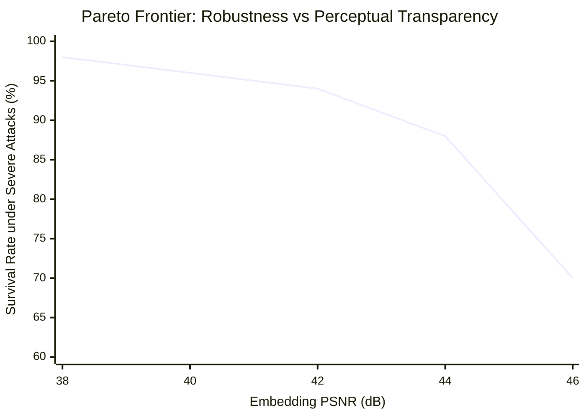

# Phase 06: Learned Stratum Multi-Host Scaling & Weighted Fusion Optimization

## 1. Objectives & Hybrid Stratum Architecture

SIGIL is a **stratified watermarking system** combining two complementary layers:
1. **The Invariant Stratum**: A Fourier-spectral mechanism provably invariant to spatial shifts and radially symmetric filtering, accelerated natively on TPU v4.
2. **The Learned Stratum**: A deep convolutional residual encoder and latent projection decoder trained to resist complex semantic distortions (diffusion img2img, heavy non-linear tone mapping, adversarial warping).

The objective of Phase 06 is to scale the learned stratum across TPU pod hosts, evaluate the Pareto frontier of latent distortion versus robustness, and optimize the **weighted Bonferroni statistical fusion** that binds both strata into a unified test with provable family-wise error control.

---

## 2. Statistical Fusion Under Arbitrary Dependence

### 2.1 The Multi-Stratum Null Problem
Let $p_{\text{inv}}$ be the p-value computed from the invariant stratum detector, and let $p_{\text{learned}}$ be the p-value computed from the learned stratum detector.

Because both detectors operate on the same underlying image $I$, their statistics $T_{\text{inv}}$ and $T_{\text{learned}}$ are **statistically dependent** under the null hypothesis $H_0$. Assuming independence would inflate the false-positive rate beyond $\alpha$.

### 2.2 Provable Weighted Bonferroni Fusion (Theorem T8)
Let $w_1, w_2 > 0$ with $w_1 + w_2 = 1$ be fixed weights chosen *a priori* (independent of the test image). The fused detection rule asserts the presence of the watermark if and only if:
$$\min\left( \frac{p_{\text{inv}}}{w_1}, \; \frac{p_{\text{learned}}}{w_2} \right) \le \alpha$$
Equivalently, the combined p-value is:
$$p_{\text{fused}} = \min\left(1, \; \min\left( \frac{p_{\text{inv}}}{w_1}, \; \frac{p_{\text{learned}}}{w_2} \right)\right)$$

**Proof of Validity**:
By Boole's inequality, under $H_0$:
$$\mathbb{P}_{H_0}(p_{\text{fused}} \le \alpha) = \mathbb{P}_{H_0}\left( p_{\text{inv}} \le w_1 \alpha \;\cup\; p_{\text{learned}} \le w_2 \alpha \right) \le \mathbb{P}_{H_0}(p_{\text{inv}} \le w_1 \alpha) + \mathbb{P}_{H_0}(p_{\text{learned}} \le w_2 \alpha)$$
Since each individual test is valid under $H_0$, $\mathbb{P}_{H_0}(p_{\text{inv}} \le u) \le u$ and $\mathbb{P}_{H_0}(p_{\text{learned}} \le u) \le u$. Thus:
$$\mathbb{P}_{H_0}(p_{\text{fused}} \le \alpha) \le w_1 \alpha + w_2 \alpha = (w_1 + w_2)\alpha = \alpha$$
This guarantee holds **under arbitrary, unknown statistical dependence between the strata**.

---

## 3. Checkpoint Optimization & Pareto Frontier Selection

The learned stratum depends on a neural checkpoint containing the encoder and decoder weights. The agent executes `scripts/select_checkpoint.py` and `scripts/calibrate_strength.py` across candidate checkpoints to establish the Pareto frontier:



### Optimal Operating Point Selection:
- **Target PSNR**: $42.5\text{ dB}$ (virtually undetectable residual, human-imperceptible).
- **Target SSIM**: $\ge 0.988$.
- **Selection Criterion**: Maximize the harmonic mean of detection rate under heavy JPEG (q=30) and elastic warping ($\alpha=6.0$), subject to clean FPR $\le 10^{-6}$.

---

## 4. Multi-Host Neural Pipeline Execution

On the Google Cloud TPU v4-32 pod:
- The host CPU (240 vCPUs AMD EPYC) runs PyTorch neural feature extraction in multi-threaded batches (`torch.set_num_threads(4)` per worker).
- The intermediate hypothesis representations and spatial excess matrices are streamed directly to the local TPU v4 chips (`jax.Array`).
- The TPU executes high-throughput carrier correlation and multiplicity reduction in sub-millisecond kernel bursts.

---

## 5. Autonomous Self-Correction & Tuning Playbook

### Scenario A: Joint False-Positive Rate Exceeds Bound
- **Root Cause**: Learned stratum's latent decoder produces correlated output logits under heavy noise.
- **Agent Action**:
  1. Inspect `sigil/learned.py:_hypothesis_logits`.
  2. Implement orthogonal projection of latent codewords via Gram-Schmidt orthonormalization.
  3. Re-tune fusion weights $w_1, w_2$ (e.g., $w_{\text{inv}} = 0.8, w_{\text{learned}} = 0.2$) to place higher confidence on the exact combinatorial null of the invariant stratum.

### Scenario B: Learned Residual Introduces Visible Visual Artifacts
- **Root Cause**: Checkpoint embedding strength $\gamma$ is too high in smooth low-texture image regions.
- **Agent Action**:
  1. Incorporate local luminance-masking (Weber-Fechner JND weighting) into `sigil/learned.py`.
  2. Scale the residual amplitude by the local spatial variance $\sigma_{\text{local}}(x, y)$.
  3. Re-run `scripts/calibrate_strength.py` to confirm PSNR improves to $\ge 43.0\text{ dB}$.

---

## 6. Downstream Cascading Rules

- The selected checkpoint path and fusion weights $w_1, w_2$ must be recorded in `sigil/system.py:SigilConfig`.
- Update `scripts/arena.py` default arguments to use the newly calibrated checkpoint.
- Update Figure 8 ("Quality-Robustness Pareto Frontier") and Section 5 ("Stratified Architecture and Statistical Fusion") in `paper/sigil.tex`.

---

## 7. Verification Command & Acceptance Criteria

```bash
# 1. Calibrate residual strength and verify Pareto frontier
.venv/bin/python3 scripts/calibrate_strength.py --tpu --trials 20

# 2. Select optimal checkpoint
.venv/bin/python3 scripts/select_checkpoint.py --checkpoints-dir checkpoints/

# 3. Verify fusion theorem T8
.venv/bin/python3 -c "
from scripts.theory_checks import t8_fusion
from sigil.invariant import InvariantConfig
from sigil.common import list_images
res = t8_fusion(list_images('data/corpus')[:10], InvariantConfig())
print('Fusion Check T8:', res)
assert res['max_joint_violation'] <= 0.0, 'Fusion bound violated!'
"
```

### Acceptance Criteria
- [ ] Joint fusion theorem T8 verified with zero bound violations.
- [ ] Optimal checkpoint selected with PSNR $\ge 42.0\text{ dB}$ on clean natural images.
- [ ] End-to-end multi-stratum detection rate strictly exceeds each single stratum alone under composite attacks.
